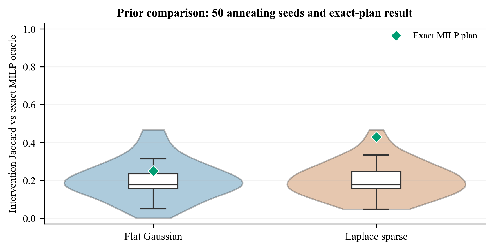
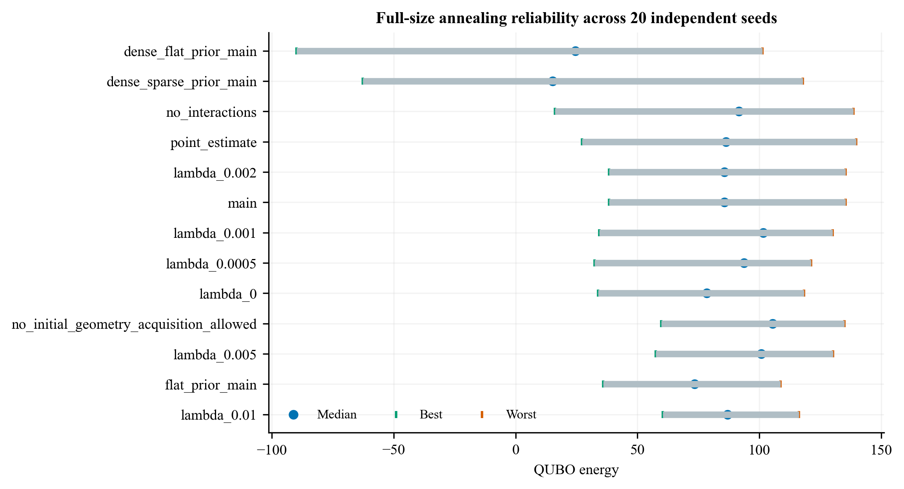
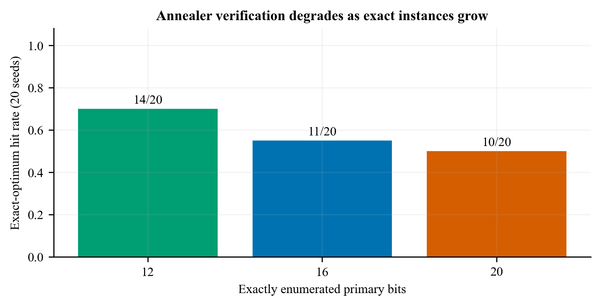
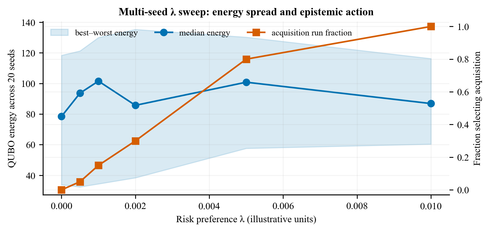
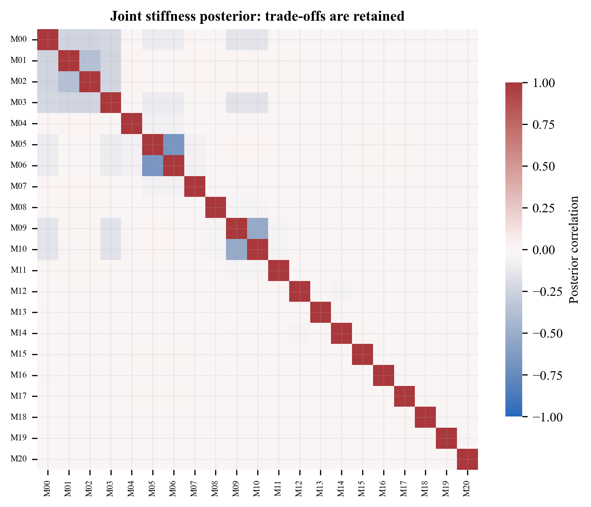
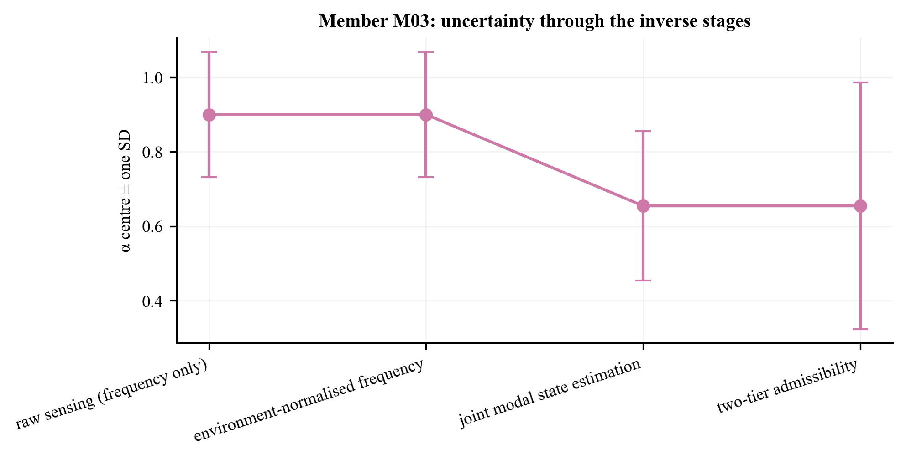

# Synthetic structural assessment and retrofit-planning demonstration

> **Mandatory scope warning:** this is a plumbing and uncertainty-propagation study, not validation. No number below is a finding about concrete. Every empirical constant, generated observation, derived result and decision is tagged `source=illustrative`.

## Headline diagnosis and fix

The earlier prior-plan comparison mixed four effects. The evidence supports **large annealing error**, **a noisy annealed oracle**, and **material Laplace shrinkage bias on genuinely damaged members**. The exact MILP comparison then shows the residual prior effect after removing both solver confounders: With annealing removed, the sparse-prior exact-plan Jaccard is 0.429 versus 0.250 for the flat prior. The sparse prior helps the exact decision in this realization. Therefore the observed 0.313 → 0.100 reversal was caused by comparing noisy searches, not by the sparse prior producing a worse exact plan. Also, the sparse estimate was not uniformly “better”: its lower SD and correlation came with worse truth bias and interval coverage.

The planning fix is an equivalent hard-constraint MILP solved by the open-source HiGHS backend. It preserves the QUBO objective and formulation in the codebase, linearises every binary product, and replaces penalty enforcement with the original linear constraints. All three 504-primary-bit full-size problems—flat, sparse, and hidden-state oracle—reached zero-gap proven optima.

## Part A — does the single-run comparison measure the solver?

Each prior was annealed from 50 independent seeds. Every run is compared with the fixed exact MILP oracle, so the distribution below contains prior-plan annealing variability but not oracle-plan variability.

| prior | seed_count | mean_jaccard | median_jaccard | q1_jaccard | q3_jaccard | iqr_jaccard | min_jaccard | max_jaccard | source |
| --- | --- | --- | --- | --- | --- | --- | --- | --- | --- |
| flat_prior | 50 | 0.20336 | 0.17647 | 0.15789 | 0.23529 | 0.077399 | 0 | 0.46667 | illustrative |
| sparse_prior | 50 | 0.20388 | 0.17647 | 0.15789 | 0.24632 | 0.088429 | 0.047619 | 0.46667 | illustrative |

| configuration | pooled_qubo_energy | jaccard_vs_milp_oracle | selected_intervention_pairs | source |
| --- | --- | --- | --- | --- |
| flat_prior | 12.884 | 0.11111 | 10 | illustrative |
| sparse_prior | 15.827 | 0.23529 | 11 | illustrative |
| ground_truth_oracle | -61.079 | 0.33333 | 10 | illustrative |

Mann–Whitney p = 0.9751, Cliff's delta (flat minus sparse) = 0.004, and IQR overlap fraction = 1.000. Decision rule: `p <= 0.05 AND |Cliff delta| >= 0.33 AND IQR overlap fraction < 0.25`.

**Verdict:** The two 50-seed Jaccard distributions overlap substantially and are not distinguishable under the declared rule. Therefore the reported 0.313 → 0.100 single-run comparison is not evidence about the prior.

## Part B — member bias and interval coverage

Positive `estimated_minus_true_alpha` means shrinkage toward the undamaged value α=1. In the main case, mean bias on the 12 genuinely damaged members is 0.116 under the flat prior and 0.195 under Laplace: an added +0.079 toward undamaged. The declared material-bias trigger is 0.050; it is **True**.

| case | prior | member_count | mean_bias_all_members | median_bias_all_members | interval_90_empirical_coverage_all_members | genuinely_damaged_member_count | mean_bias_genuinely_damaged_members | median_bias_genuinely_damaged_members | fraction_damaged_members_biased_toward_undamaged | source |
| --- | --- | --- | --- | --- | --- | --- | --- | --- | --- | --- |
| clustered_main_case | weak_gaussian_flat | 21 | 0.019098 | 0.042038 | 0.90476 | 12 | 0.11574 | 0.09799 | 1 | illustrative |
| clustered_main_case | hierarchical_laplace_sparse | 21 | 0.074379 | 0.073236 | 0.57143 | 12 | 0.19484 | 0.23639 | 0.83333 | illustrative |
| clustered_main_case | hierarchical_horseshoe | 21 | 0.096567 | 0.23125 | 0.047619 | 12 | 0.2812 | 0.25696 | 1 | illustrative |
| dense_damage_sparsity_false | weak_gaussian_flat | 21 | 0.032172 | 0.012283 | 1 | 21 | 0.032172 | 0.012283 | 0.66667 | illustrative |
| dense_damage_sparsity_false | hierarchical_laplace_sparse | 21 | 0.090542 | 0.18046 | 0.38095 | 21 | 0.090542 | 0.18046 | 0.66667 | illustrative |
| dense_damage_sparsity_false | hierarchical_horseshoe | 21 | 0.11321 | 0.21487 | 0.28571 | 21 | 0.11321 | 0.21487 | 0.66667 | illustrative |

Per-member values for both truth cases and every evaluated prior:

| case | member | prior | true_alpha | estimated_alpha_mean | estimated_minus_true_alpha | posterior_sd | credible_interval_90_low | credible_interval_90_high | credible_interval_contains_truth | genuinely_damaged | source |
| --- | --- | --- | --- | --- | --- | --- | --- | --- | --- | --- | --- |
| clustered_main_case | M00 | weak_gaussian_flat | 0.99163 | 0.81148 | -0.18015 | 0.17021 | 0.53148 | 1 | True | False | illustrative |
| clustered_main_case | M01 | weak_gaussian_flat | 0.67946 | 0.79292 | 0.11346 | 0.16267 | 0.52533 | 1 | True | True | illustrative |
| clustered_main_case | M02 | weak_gaussian_flat | 0.76736 | 0.78241 | 0.015041 | 0.16444 | 0.5119 | 1 | True | True | illustrative |
| clustered_main_case | M03 | weak_gaussian_flat | 0.98183 | 0.72723 | -0.2546 | 0.086019 | 0.58573 | 0.86873 | False | False | illustrative |
| clustered_main_case | M04 | weak_gaussian_flat | 0.74102 | 0.83602 | 0.095001 | 0.16417 | 0.56596 | 1 | True | True | illustrative |
| clustered_main_case | M05 | weak_gaussian_flat | 0.95438 | 0.80176 | -0.15262 | 0.15186 | 0.55195 | 1 | True | False | illustrative |
| clustered_main_case | M06 | weak_gaussian_flat | 0.70639 | 0.79479 | 0.088399 | 0.15369 | 0.54197 | 1 | True | True | illustrative |
| clustered_main_case | M07 | weak_gaussian_flat | 0.74911 | 0.79114 | 0.042038 | 0.15019 | 0.54409 | 1 | True | True | illustrative |
| clustered_main_case | M08 | weak_gaussian_flat | 0.99982 | 0.85676 | -0.14306 | 0.1736 | 0.57119 | 1 | True | False | illustrative |
| clustered_main_case | M09 | weak_gaussian_flat | 0.76378 | 0.81981 | 0.056035 | 0.15771 | 0.56038 | 1 | True | True | illustrative |
| clustered_main_case | M10 | weak_gaussian_flat | 0.88686 | 0.81775 | -0.069103 | 0.15841 | 0.55716 | 1 | True | False | illustrative |
| clustered_main_case | M11 | weak_gaussian_flat | 0.74433 | 0.84531 | 0.10098 | 0.17402 | 0.55904 | 1 | True | True | illustrative |
| clustered_main_case | M12 | weak_gaussian_flat | 0.87421 | 0.84675 | -0.027464 | 0.16472 | 0.57579 | 1 | True | False | illustrative |
| clustered_main_case | M13 | weak_gaussian_flat | 0.66831 | 0.86874 | 0.20043 | 0.17441 | 0.58184 | 1 | True | True | illustrative |
| clustered_main_case | M14 | weak_gaussian_flat | 0.8963 | 0.84935 | -0.046945 | 0.16642 | 0.5756 | 1 | True | False | illustrative |
| clustered_main_case | M15 | weak_gaussian_flat | 0.75333 | 0.85696 | 0.10363 | 0.17463 | 0.56969 | 1 | True | True | illustrative |
| clustered_main_case | M16 | weak_gaussian_flat | 0.92337 | 0.87108 | -0.052295 | 0.17745 | 0.57918 | 1 | True | False | illustrative |
| clustered_main_case | M17 | weak_gaussian_flat | 0.73426 | 0.85768 | 0.12342 | 0.17485 | 0.57005 | 1 | True | True | illustrative |
| clustered_main_case | M18 | weak_gaussian_flat | 0.93393 | 0.87228 | -0.061649 | 0.1775 | 0.58029 | 1 | True | False | illustrative |
| clustered_main_case | M19 | weak_gaussian_flat | 0.52703 | 0.88642 | 0.35939 | 0.17942 | 0.59128 | 1 | False | True | illustrative |
| clustered_main_case | M20 | weak_gaussian_flat | 0.78145 | 0.87255 | 0.091108 | 0.17759 | 0.58041 | 1 | True | True | illustrative |
| clustered_main_case | M00 | hierarchical_laplace_sparse | 0.99163 | 0.65406 | -0.33757 | 0.20013 | 0.35 | 0.98328 | False | False | illustrative |
| clustered_main_case | M01 | hierarchical_laplace_sparse | 0.67946 | 0.7947 | 0.11525 | 0.14615 | 0.55429 | 1 | True | True | illustrative |
| clustered_main_case | M02 | hierarchical_laplace_sparse | 0.76736 | 0.79467 | 0.027305 | 0.14633 | 0.55396 | 1 | True | True | illustrative |
| clustered_main_case | M03 | hierarchical_laplace_sparse | 0.98183 | 0.65452 | -0.32731 | 0.20069 | 0.35 | 0.98466 | True | False | illustrative |
| clustered_main_case | M04 | hierarchical_laplace_sparse | 0.74102 | 0.98721 | 0.24619 | 0.052614 | 0.90066 | 1 | False | True | illustrative |
| clustered_main_case | M05 | hierarchical_laplace_sparse | 0.95438 | 0.70366 | -0.25072 | 0.15919 | 0.4418 | 0.96552 | True | False | illustrative |
| clustered_main_case | M06 | hierarchical_laplace_sparse | 0.70639 | 0.70333 | -0.0030651 | 0.15925 | 0.44136 | 0.96529 | True | True | illustrative |
| clustered_main_case | M07 | hierarchical_laplace_sparse | 0.74911 | 0.98717 | 0.23806 | 0.052644 | 0.90057 | 1 | False | True | illustrative |
| clustered_main_case | M08 | hierarchical_laplace_sparse | 0.99982 | 0.99199 | -0.0078221 | 0.049036 | 0.91133 | 1 | True | False | illustrative |
| clustered_main_case | M09 | hierarchical_laplace_sparse | 0.76378 | 0.73413 | -0.029648 | 0.15773 | 0.47466 | 0.9936 | True | True | illustrative |
| clustered_main_case | M10 | hierarchical_laplace_sparse | 0.88686 | 0.73402 | -0.15284 | 0.15769 | 0.47462 | 0.99342 | True | False | illustrative |
| clustered_main_case | M11 | hierarchical_laplace_sparse | 0.74433 | 0.992 | 0.24767 | 0.049033 | 0.91134 | 1 | False | True | illustrative |
| clustered_main_case | M12 | hierarchical_laplace_sparse | 0.87421 | 0.96904 | 0.094822 | 0.068143 | 0.85694 | 1 | True | False | illustrative |
| clustered_main_case | M13 | hierarchical_laplace_sparse | 0.66831 | 0.99163 | 0.32331 | 0.049244 | 0.91062 | 1 | False | True | illustrative |
| clustered_main_case | M14 | hierarchical_laplace_sparse | 0.8963 | 0.96953 | 0.073236 | 0.067724 | 0.85813 | 1 | True | False | illustrative |
| clustered_main_case | M15 | hierarchical_laplace_sparse | 0.75333 | 0.98806 | 0.23473 | 0.051979 | 0.90255 | 1 | False | True | illustrative |
| clustered_main_case | M16 | hierarchical_laplace_sparse | 0.92337 | 0.99464 | 0.071263 | 0.047566 | 0.91639 | 1 | True | False | illustrative |
| clustered_main_case | M17 | hierarchical_laplace_sparse | 0.73426 | 0.98806 | 0.2538 | 0.051975 | 0.90256 | 1 | False | True | illustrative |
| clustered_main_case | M18 | hierarchical_laplace_sparse | 0.93393 | 0.99475 | 0.060824 | 0.047512 | 0.9166 | 1 | True | False | illustrative |
| clustered_main_case | M19 | hierarchical_laplace_sparse | 0.52703 | 0.99818 | 0.47115 | 0.04638 | 0.92188 | 1 | False | True | illustrative |
| clustered_main_case | M20 | hierarchical_laplace_sparse | 0.78145 | 0.99476 | 0.21331 | 0.04751 | 0.9166 | 1 | False | True | illustrative |
| clustered_main_case | M00 | hierarchical_horseshoe | 0.99163 | 0.64223 | -0.3494 | 0.15906 | 0.38058 | 0.90388 | False | False | illustrative |
| clustered_main_case | M01 | hierarchical_horseshoe | 0.67946 | 0.99863 | 0.31917 | 0.0066799 | 0.98764 | 1 | False | True | illustrative |
| clustered_main_case | M02 | hierarchical_horseshoe | 0.76736 | 0.99861 | 0.23125 | 0.0066822 | 0.98762 | 1 | False | True | illustrative |
| clustered_main_case | M03 | hierarchical_horseshoe | 0.98183 | 0.61179 | -0.37004 | 0.029102 | 0.56392 | 0.65966 | False | False | illustrative |
| clustered_main_case | M04 | hierarchical_horseshoe | 0.74102 | 0.99954 | 0.25852 | 0.0066364 | 0.98863 | 1 | False | True | illustrative |
| clustered_main_case | M05 | hierarchical_horseshoe | 0.95438 | 0.49504 | -0.45934 | 0.090375 | 0.35 | 0.64371 | False | False | illustrative |
| clustered_main_case | M06 | hierarchical_horseshoe | 0.70639 | 0.99756 | 0.29116 | 0.0067906 | 0.98638 | 1 | False | True | illustrative |
| clustered_main_case | M07 | hierarchical_horseshoe | 0.74911 | 0.9995 | 0.25039 | 0.0066368 | 0.98858 | 1 | False | True | illustrative |
| clustered_main_case | M08 | hierarchical_horseshoe | 0.99982 | 0.99967 | -0.00014233 | 0.0066341 | 0.98876 | 1 | True | False | illustrative |
| clustered_main_case | M09 | hierarchical_horseshoe | 0.76378 | 0.99927 | 0.23549 | 0.0066456 | 0.98834 | 1 | False | True | illustrative |
| clustered_main_case | M10 | hierarchical_horseshoe | 0.88686 | 0.35 | -0.53686 | 0.087983 | 0.35 | 0.49473 | False | False | illustrative |
| clustered_main_case | M11 | hierarchical_horseshoe | 0.74433 | 0.99972 | 0.25539 | 0.0066333 | 0.98881 | 1 | False | True | illustrative |
| clustered_main_case | M12 | hierarchical_horseshoe | 0.87421 | 0.99901 | 0.1248 | 0.0066564 | 0.98806 | 1 | False | False | illustrative |
| clustered_main_case | M13 | hierarchical_horseshoe | 0.66831 | 0.99926 | 0.33095 | 0.0066455 | 0.98833 | 1 | False | True | illustrative |
| clustered_main_case | M14 | hierarchical_horseshoe | 0.8963 | 0.99887 | 0.10257 | 0.0066642 | 0.9879 | 1 | False | False | illustrative |
| clustered_main_case | M15 | hierarchical_horseshoe | 0.75333 | 0.99923 | 0.2459 | 0.006647 | 0.98829 | 1 | False | True | illustrative |
| clustered_main_case | M16 | hierarchical_horseshoe | 0.92337 | 0.99958 | 0.076207 | 0.006636 | 0.98866 | 1 | False | False | illustrative |
| clustered_main_case | M17 | hierarchical_horseshoe | 0.73426 | 0.99922 | 0.26495 | 0.0066473 | 0.98828 | 1 | False | True | illustrative |
| clustered_main_case | M18 | hierarchical_horseshoe | 0.93393 | 0.99967 | 0.065737 | 0.0066344 | 0.98875 | 1 | False | False | illustrative |
| clustered_main_case | M19 | hierarchical_horseshoe | 0.52703 | 0.99989 | 0.47286 | 0.0066317 | 0.98898 | 1 | False | True | illustrative |
| clustered_main_case | M20 | hierarchical_horseshoe | 0.78145 | 0.99978 | 0.21833 | 0.0066327 | 0.98887 | 1 | False | True | illustrative |
| dense_damage_sparsity_false | M00 | weak_gaussian_flat | 0.66885 | 0.67366 | 0.0048193 | 0.17193 | 0.39084 | 0.95649 | True | True | illustrative |
| dense_damage_sparsity_false | M01 | weak_gaussian_flat | 0.78951 | 0.69708 | -0.092432 | 0.1434 | 0.46118 | 0.93298 | True | True | illustrative |
| dense_damage_sparsity_false | M02 | weak_gaussian_flat | 0.72758 | 0.69715 | -0.030436 | 0.14213 | 0.46334 | 0.93095 | True | True | illustrative |
| dense_damage_sparsity_false | M03 | weak_gaussian_flat | 0.72261 | 0.67326 | -0.049353 | 0.172 | 0.39031 | 0.9562 | True | True | illustrative |
| dense_damage_sparsity_false | M04 | weak_gaussian_flat | 0.72029 | 0.72658 | 0.0062815 | 0.16332 | 0.45791 | 0.99524 | True | True | illustrative |
| dense_damage_sparsity_false | M05 | weak_gaussian_flat | 0.66757 | 0.67233 | 0.0047592 | 0.1519 | 0.42245 | 0.9222 | True | True | illustrative |
| dense_damage_sparsity_false | M06 | weak_gaussian_flat | 0.67396 | 0.6721 | -0.0018649 | 0.15165 | 0.42263 | 0.92157 | True | True | illustrative |
| dense_damage_sparsity_false | M07 | weak_gaussian_flat | 0.69532 | 0.72589 | 0.030567 | 0.16353 | 0.45688 | 0.9949 | True | True | illustrative |
| dense_damage_sparsity_false | M08 | weak_gaussian_flat | 0.66449 | 0.77033 | 0.10584 | 0.17325 | 0.48533 | 1 | True | True | illustrative |
| dense_damage_sparsity_false | M09 | weak_gaussian_flat | 0.65113 | 0.64315 | -0.0079759 | 0.1545 | 0.38899 | 0.89731 | True | True | illustrative |
| dense_damage_sparsity_false | M10 | weak_gaussian_flat | 0.6799 | 0.64318 | -0.036727 | 0.15458 | 0.38889 | 0.89746 | True | True | illustrative |
| dense_damage_sparsity_false | M11 | weak_gaussian_flat | 0.74598 | 0.77025 | 0.024277 | 0.17331 | 0.48515 | 1 | True | True | illustrative |
| dense_damage_sparsity_false | M12 | weak_gaussian_flat | 0.64792 | 0.75238 | 0.10445 | 0.15871 | 0.49129 | 1 | True | True | illustrative |
| dense_damage_sparsity_false | M13 | weak_gaussian_flat | 0.80394 | 0.81622 | 0.012283 | 0.17278 | 0.532 | 1 | True | True | illustrative |
| dense_damage_sparsity_false | M14 | weak_gaussian_flat | 0.78423 | 0.75234 | -0.031889 | 0.15874 | 0.49122 | 1 | True | True | illustrative |
| dense_damage_sparsity_false | M15 | weak_gaussian_flat | 0.66724 | 0.78009 | 0.11285 | 0.17245 | 0.49641 | 1 | True | True | illustrative |
| dense_damage_sparsity_false | M16 | weak_gaussian_flat | 0.69003 | 0.82734 | 0.13731 | 0.17706 | 0.53608 | 1 | True | True | illustrative |
| dense_damage_sparsity_false | M17 | weak_gaussian_flat | 0.6815 | 0.78006 | 0.098553 | 0.17245 | 0.49638 | 1 | True | True | illustrative |
| dense_damage_sparsity_false | M18 | weak_gaussian_flat | 0.78866 | 0.82193 | 0.033268 | 0.17757 | 0.52984 | 1 | True | True | illustrative |
| dense_damage_sparsity_false | M19 | weak_gaussian_flat | 0.68505 | 0.87023 | 0.18518 | 0.17965 | 0.5747 | 1 | True | True | illustrative |
| dense_damage_sparsity_false | M20 | weak_gaussian_flat | 0.75606 | 0.8219 | 0.065839 | 0.17757 | 0.5298 | 1 | True | True | illustrative |
| dense_damage_sparsity_false | M00 | hierarchical_laplace_sparse | 0.66885 | 0.67809 | 0.0092487 | 0.25773 | 0.35 | 1 | True | True | illustrative |
| dense_damage_sparsity_false | M01 | hierarchical_laplace_sparse | 0.78951 | 0.96798 | 0.17847 | 0.089331 | 0.82103 | 1 | False | True | illustrative |
| dense_damage_sparsity_false | M02 | hierarchical_laplace_sparse | 0.72758 | 0.98014 | 0.25256 | 0.075179 | 0.85647 | 1 | False | True | illustrative |
| dense_damage_sparsity_false | M03 | hierarchical_laplace_sparse | 0.72261 | 0.57869 | -0.14392 | 0.26507 | 0.35 | 1 | True | True | illustrative |
| dense_damage_sparsity_false | M04 | hierarchical_laplace_sparse | 0.72029 | 0.70238 | -0.017913 | 0.19634 | 0.3794 | 1 | True | True | illustrative |
| dense_damage_sparsity_false | M05 | hierarchical_laplace_sparse | 0.66757 | 0.56835 | -0.099221 | 0.20644 | 0.35 | 0.90794 | True | True | illustrative |
| dense_damage_sparsity_false | M06 | hierarchical_laplace_sparse | 0.67396 | 0.58853 | -0.085432 | 0.23994 | 0.35 | 0.98324 | True | True | illustrative |
| dense_damage_sparsity_false | M07 | hierarchical_laplace_sparse | 0.69532 | 0.98741 | 0.29209 | 0.066406 | 0.87817 | 1 | False | True | illustrative |
| dense_damage_sparsity_false | M08 | hierarchical_laplace_sparse | 0.66449 | 0.99164 | 0.32715 | 0.062429 | 0.88895 | 1 | False | True | illustrative |
| dense_damage_sparsity_false | M09 | hierarchical_laplace_sparse | 0.65113 | 0.39211 | -0.25902 | 0.27559 | 0.35 | 0.84545 | True | True | illustrative |
| dense_damage_sparsity_false | M10 | hierarchical_laplace_sparse | 0.6799 | 0.36744 | -0.31246 | 0.26662 | 0.35 | 0.80603 | True | True | illustrative |
| dense_damage_sparsity_false | M11 | hierarchical_laplace_sparse | 0.74598 | 0.99075 | 0.24478 | 0.063187 | 0.88681 | 1 | False | True | illustrative |
| dense_damage_sparsity_false | M12 | hierarchical_laplace_sparse | 0.64792 | 0.71921 | 0.071284 | 0.23872 | 0.35 | 1 | True | True | illustrative |
| dense_damage_sparsity_false | M13 | hierarchical_laplace_sparse | 0.80394 | 0.9844 | 0.18046 | 0.070109 | 0.86907 | 1 | False | True | illustrative |
| dense_damage_sparsity_false | M14 | hierarchical_laplace_sparse | 0.78423 | 0.35 | -0.43423 | 0.18149 | 0.35 | 0.64856 | False | True | illustrative |
| dense_damage_sparsity_false | M15 | hierarchical_laplace_sparse | 0.66724 | 0.99013 | 0.3229 | 0.063947 | 0.88494 | 1 | False | True | illustrative |
| dense_damage_sparsity_false | M16 | hierarchical_laplace_sparse | 0.69003 | 0.99684 | 0.30681 | 0.05914 | 0.89955 | 1 | False | True | illustrative |
| dense_damage_sparsity_false | M17 | hierarchical_laplace_sparse | 0.6815 | 0.98955 | 0.30804 | 0.064525 | 0.8834 | 1 | False | True | illustrative |
| dense_damage_sparsity_false | M18 | hierarchical_laplace_sparse | 0.78866 | 0.99499 | 0.20633 | 0.060026 | 0.89625 | 1 | False | True | illustrative |
| dense_damage_sparsity_false | M19 | hierarchical_laplace_sparse | 0.68505 | 0.99961 | 0.31455 | 0.058516 | 0.90335 | 1 | False | True | illustrative |
| dense_damage_sparsity_false | M20 | hierarchical_laplace_sparse | 0.75606 | 0.99497 | 0.23891 | 0.06004 | 0.8962 | 1 | False | True | illustrative |
| dense_damage_sparsity_false | M00 | hierarchical_horseshoe | 0.66885 | 0.5496 | -0.11925 | 0.22266 | 0.35 | 0.91587 | True | True | illustrative |
| dense_damage_sparsity_false | M01 | hierarchical_horseshoe | 0.78951 | 0.99933 | 0.20982 | 0.0098316 | 0.98316 | 1 | False | True | illustrative |
| dense_damage_sparsity_false | M02 | hierarchical_horseshoe | 0.72758 | 0.99916 | 0.27157 | 0.0098436 | 0.98296 | 1 | False | True | illustrative |
| dense_damage_sparsity_false | M03 | hierarchical_horseshoe | 0.72261 | 0.55115 | -0.17146 | 0.25391 | 0.35 | 0.96883 | True | True | illustrative |
| dense_damage_sparsity_false | M04 | hierarchical_horseshoe | 0.72029 | 0.99933 | 0.27904 | 0.0098282 | 0.98316 | 1 | False | True | illustrative |
| dense_damage_sparsity_false | M05 | hierarchical_horseshoe | 0.66757 | 0.55526 | -0.11231 | 0.21347 | 0.35 | 0.90642 | True | True | illustrative |
| dense_damage_sparsity_false | M06 | hierarchical_horseshoe | 0.67396 | 0.5277 | -0.14627 | 0.17828 | 0.35 | 0.82097 | True | True | illustrative |
| dense_damage_sparsity_false | M07 | hierarchical_horseshoe | 0.69532 | 0.99909 | 0.30377 | 0.0098451 | 0.9829 | 1 | False | True | illustrative |
| dense_damage_sparsity_false | M08 | hierarchical_horseshoe | 0.66449 | 0.99947 | 0.33498 | 0.0098223 | 0.98331 | 1 | False | True | illustrative |
| dense_damage_sparsity_false | M09 | hierarchical_horseshoe | 0.65113 | 0.36731 | -0.28383 | 0.25876 | 0.35 | 0.79297 | True | True | illustrative |
| dense_damage_sparsity_false | M10 | hierarchical_horseshoe | 0.6799 | 0.39618 | -0.28372 | 0.26623 | 0.35 | 0.83414 | True | True | illustrative |
| dense_damage_sparsity_false | M11 | hierarchical_horseshoe | 0.74598 | 0.99946 | 0.25349 | 0.0098223 | 0.98331 | 1 | False | True | illustrative |
| dense_damage_sparsity_false | M12 | hierarchical_horseshoe | 0.64792 | 0.35 | -0.29792 | 0.11728 | 0.35 | 0.54293 | False | True | illustrative |
| dense_damage_sparsity_false | M13 | hierarchical_horseshoe | 0.80394 | 0.99927 | 0.19533 | 0.0098359 | 0.98309 | 1 | False | True | illustrative |
| dense_damage_sparsity_false | M14 | hierarchical_horseshoe | 0.78423 | 0.9991 | 0.21487 | 0.0098487 | 0.9829 | 1 | False | True | illustrative |
| dense_damage_sparsity_false | M15 | hierarchical_horseshoe | 0.66724 | 0.99941 | 0.33217 | 0.0098275 | 0.98324 | 1 | False | True | illustrative |
| dense_damage_sparsity_false | M16 | hierarchical_horseshoe | 0.69003 | 0.9998 | 0.30977 | 0.009813 | 0.98366 | 1 | False | True | illustrative |
| dense_damage_sparsity_false | M17 | hierarchical_horseshoe | 0.6815 | 0.99934 | 0.31784 | 0.0098314 | 0.98317 | 1 | False | True | illustrative |
| dense_damage_sparsity_false | M18 | hierarchical_horseshoe | 0.78866 | 0.99967 | 0.21101 | 0.0098157 | 0.98353 | 1 | False | True | illustrative |
| dense_damage_sparsity_false | M19 | hierarchical_horseshoe | 0.68505 | 0.99997 | 0.31492 | 0.0098112 | 0.98383 | 1 | False | True | illustrative |
| dense_damage_sparsity_false | M20 | hierarchical_horseshoe | 0.75606 | 0.99967 | 0.24362 | 0.0098156 | 0.98353 | 1 | False | True | illustrative |

Main-case 90% interval coverage is 90.5% flat versus 57.1% Laplace. Distributed-truth coverage is 100.0% versus 38.1%. Thus the smaller Laplace SD is overconfidence here, not uniformly better estimation.

## Part C — is the oracle solver-limited?

The annealed hidden-state oracle across 50 seeds had best energy -36.502, median 33.439, worst 104.311, and spread 140.813. The exact oracle optimum is -101.747. Therefore the former Jaccard denominator was another noisy search, not a true optimum.

## Part D — exact MILP equivalence and full-size annealing gap

| configuration | objective_value | reference_qubo_energy | qubo_cross_score_absolute_difference | solve_time_seconds | proven_optimal | mip_gap | mip_dual_bound | mip_node_count | primary_binary_count | binary_variable_count_including_y | product_variable_count | linear_constraint_count | independent_violation_count | solver | source |
| --- | --- | --- | --- | --- | --- | --- | --- | --- | --- | --- | --- | --- | --- | --- | --- |
| flat_prior | -37.211 | -37.211 | 1.6816e-10 | 312.73 | True | 0 | -37.211 | 504 | 504 | 630 | 24990 | 78864 | 0 | SciPy milp with open-source HiGHS backend | illustrative |
| sparse_prior | -24.298 | -24.298 | 1.2932e-09 | 59.707 | True | 0 | -24.298 | 19 | 504 | 630 | 10941 | 36711 | 0 | SciPy milp with open-source HiGHS backend | illustrative |
| ground_truth_oracle | -101.75 | -101.75 | 3.1029e-09 | 51.292 | True | 0 | -101.75 | 1 | 504 | 630 | 20268 | 64716 | 0 | SciPy milp with open-source HiGHS backend | illustrative |

| configuration | milp_optimum_energy | milp_proven_optimal | qubo_best_of_50_energy | qubo_median_of_50_energy | qubo_pooled_best_known_energy | best_of_50_absolute_optimality_gap | best_of_50_relative_optimality_gap_percent | median_absolute_optimality_gap | median_relative_optimality_gap_percent | pooled_absolute_optimality_gap | pooled_never_better_than_milp | source |
| --- | --- | --- | --- | --- | --- | --- | --- | --- | --- | --- | --- | --- |
| flat_prior | -37.211 | True | 36.332 | 78.992 | 12.884 | 73.543 | 197.64 | 116.2 | 312.28 | 50.095 | True | illustrative |
| sparse_prior | -24.298 | True | 42.455 | 94.284 | 15.827 | 66.753 | 274.73 | 118.58 | 488.03 | 40.125 | True | illustrative |
| ground_truth_oracle | -101.75 | True | -36.502 | 33.439 | -61.079 | 65.245 | 64.125 | 135.19 | 132.86 | 40.668 | True | illustrative |

For every configuration, the MILP plan's zero-penalty objective and its correctly penalised feasible-QUBO cross-score agree within the registered numerical tolerance. `pooled_never_better_than_milp=True` confirms no pooled annealing incumbent beats the proven optimum. The full-size annealing optimality gaps, previously unverifiable, are now explicit above for both the best and median of 50 seeds.

Clean exact-plan prior comparison:

| prior | milp_plan_jaccard_vs_milp_oracle | milp_prior_objective | milp_oracle_objective | source |
| --- | --- | --- | --- | --- |
| flat_prior | 0.25 | -37.211 | -101.75 | illustrative |
| sparse_prior | 0.42857 | -24.298 | -101.75 | illustrative |

**Verdict:** With annealing removed, the sparse-prior exact-plan Jaccard is 0.429 versus 0.250 for the flat prior. The sparse prior helps the exact decision in this realization.

The final production plan is now the sparse-prior MILP optimum:

| member_id | member | period | action | source |
| --- | --- | --- | --- | --- |
| 0 | M00 | 2 | cover | illustrative |
| 1 | M01 | 1 | combined | illustrative |
| 2 | M02 | 1 | cover | illustrative |
| 2 | M02 | 5 | jacket | illustrative |
| 3 | M03 | 4 | combined | illustrative |
| 5 | M05 | 1 | acquire_geometry | illustrative |
| 5 | M05 | 2 | combined | illustrative |
| 6 | M06 | 1 | acquire_geometry | illustrative |
| 6 | M06 | 3 | combined | illustrative |
| 12 | M12 | 3 | cover | illustrative |
| 14 | M14 | 4 | cover | illustrative |
| 15 | M15 | 5 | cover | illustrative |

## Part E — horseshoe alternative

Material bias triggered the horseshoe test. Its plug-in empirical-Bayes fit did not converge in the main case and did not converge in the distributed case. Main damaged-member mean bias was 0.281 and coverage 4.8%; distributed-case bias was 0.113 and coverage 28.6%. This alternative is retained as a failed diagnostic, not adopted as a remedy.

## Which candidate causes are supported?

1. **Prior comparison measured annealing variance:** supported.
2. **Laplace posterior shrinkage bias:** supported; damaged-member bias increased by 0.079.
3. **Oracle itself was solver-limited:** supported; its 50-seed spread is 140.813 and its best annealed energy remains above the exact oracle optimum.
4. **A real prior effect remains after exact solving:** supported; exact Jaccard is 0.250 flat versus 0.429 Laplace. This is one synthetic realization, not a general prior ranking.

The remedy that succeeded is exact optimisation. The attempted horseshoe remedy is not adopted because its empirical-Bayes fit failed the convergence/coverage diagnostic. The remaining estimator bias is reported, not worked around.

## Retained QUBO verification and formulation evidence

The QUBO remains fully implemented with cover, jacket, combined, geometry acquisition, conditional deterioration `y`, two non-fungible budgets, hard-precedence penalties derived from objective bounds, outage, temporal separation, and solver-derived load-path interactions. Its independent negative controls remain:

| penalty | checker_rejected | violation_count | violation_categories | objective_only_energy | objective_delta_vs_reference | correctly_penalised_energy | conclusion | source |
| --- | --- | --- | --- | --- | --- | --- | --- | --- |
| 1 | True | 85 | catalogue_uniqueness, cover_jacket_precedence, intervention_budget, out_of_service, slack_equality, untreated_y_recurrence | -143 | -158.83 | 4.0258e+05 | checker rejected an infeasible weak-penalty solution | illustrative |
| 10 | False | 0 |  | 15.827 | 0 | 15.827 | no violation was induced at this penalty; this negative control is inconclusive, not a checker pass | illustrative |

Penalty 1 is rejected with 85 violations and an objective that appears 158.831 better than the feasible reference when constraints are underweighted. Penalty 10 remains feasible/inconclusive. The current derived bound is 5442; it was not tuned downward.

The retained 20-seed configurations and ablations:

| configuration | seed_count | best_energy | median_energy | worst_energy | energy_spread | feasible_runs | runs_with_geometry_acquisition | geometry_acquisition_run_fraction |
| --- | --- | --- | --- | --- | --- | --- | --- | --- |
| main | 20 | 38.378 | 85.712 | 135.29 | 96.909 | 20 | 6 | 0.3 |
| lambda_0 | 20 | 33.807 | 78.433 | 118.37 | 84.559 | 20 | 0 | 0 |
| lambda_0.0005 | 20 | 32.421 | 93.654 | 121.25 | 88.831 | 20 | 1 | 0.05 |
| lambda_0.001 | 20 | 34.387 | 101.53 | 130 | 95.608 | 20 | 3 | 0.15 |
| lambda_0.005 | 20 | 57.581 | 100.81 | 130.22 | 72.638 | 20 | 16 | 0.8 |
| lambda_0.01 | 20 | 60.361 | 86.864 | 116.24 | 55.874 | 20 | 20 | 1 |
| point_estimate | 20 | 27.275 | 86.253 | 139.68 | 112.4 | 20 | 0 | 0 |
| no_initial_geometry_acquisition_allowed | 20 | 59.836 | 105.43 | 134.89 | 75.052 | 20 | 9 | 0.45 |
| no_interactions | 20 | 16.201 | 91.623 | 138.57 | 122.37 | 20 | 9 | 0.45 |
| flat_prior_main | 20 | 35.982 | 73.423 | 108.6 | 72.622 | 20 | 16 | 0.8 |
| dense_sparse_prior_main | 20 | -62.591 | 15.189 | 117.86 | 180.45 | 20 | 17 | 0.85 |
| dense_flat_prior_main | 20 | -89.824 | 24.541 | 101.31 | 191.13 | 20 | 20 | 1 |
| lambda_0.002 | 20 | 38.378 | 85.712 | 135.29 | 96.909 | 20 | 6 | 0.3 |

The exact QUBO-enumeration ladder still diagnoses annealer hit rate:

| primary_bits | total_qubo_variables | raw_assignment_count | feasible_assignments | exact_optimum_energy | annealer_hits | seed_count | annealer_hit_rate | best_annealed_energy | worst_annealed_energy | exact_plan | source |
| --- | --- | --- | --- | --- | --- | --- | --- | --- | --- | --- | --- |
| 12 | 39 | 4096 | 20 | -24.447 | 14 | 20 | 0.7 | -24.447 | -15.334 | [{'member_id': 0, 'member': 'M01', 'period': 1, 'action': 'combined', 'source': 'illustrative'}] | illustrative |
| 16 | 52 | 65536 | 35 | -33.227 | 11 | 20 | 0.55 | -33.227 | -24.124 | [{'member_id': 0, 'member': 'M01', 'period': 1, 'action': 'combined', 'source': 'illustrative'}] | illustrative |
| 20 | 65 | 1048576 | 56 | -41.175 | 10 | 20 | 0.5 | -41.175 | -32.222 | [{'member_id': 0, 'member': 'M01', 'period': 1, 'action': 'combined', 'source': 'illustrative'}] | illustrative |

Beyond 20 primary bits, **annealing** optimality remains unverified; full-size **planning-problem** optimality is now verified independently by MILP. The previous λ=0.002 acquisition threshold remains an annealing artefact: best-energy monotonicity is False, while acquisition frequency changes gradually.

| lambda | seed_count | best_energy | median_energy | worst_energy | energy_spread | runs_with_geometry_acquisition | geometry_acquisition_run_fraction |
| --- | --- | --- | --- | --- | --- | --- | --- |
| 0 | 20 | 33.807 | 78.433 | 118.37 | 84.559 | 0 | 0 |
| 0.0005 | 20 | 32.421 | 93.654 | 121.25 | 88.831 | 1 | 0.05 |
| 0.001 | 20 | 34.387 | 101.53 | 130 | 95.608 | 3 | 0.15 |
| 0.002 | 20 | 38.378 | 85.712 | 135.29 | 96.909 | 6 | 0.3 |
| 0.005 | 20 | 57.581 | 100.81 | 130.22 | 72.638 | 16 | 0.8 |
| 0.01 | 20 | 60.361 | 86.864 | 116.24 | 55.874 | 20 | 1 |

The `all_reduced` ablation remains renamed `no_initial_geometry_acquisition_allowed`: no geometry is initially valid, acquisition remains permitted, and its selected best-run acquisition count is 0.

| scenario | native_qubo_energy | energy_when_scored_by_reference_objective | reference_objective_delta_vs_main | different_member_period_action_decisions | intervention_jaccard_similarity | geometry_acquisitions | feasible | source |
| --- | --- | --- | --- | --- | --- | --- | --- | --- |
| point_estimate | 27.275 | 33.168 | 17.341 | 22 | 0 | 0 | True | illustrative |
| no_initial_geometry_acquisition_allowed | 59.836 | 42.135 | 26.308 | 17 | 0.10526 | 0 | True | illustrative |
| no_interactions | 16.201 | 19.31 | 3.4834 | 3 | 0.75 | 2 | True | illustrative |
| naive_severity | 64.621 | 64.621 | 48.794 | 18 | 0 | 0 | True | illustrative |

## Retained state, transport, and classification evidence

The hidden structure remains the existing 3-storey, 3-bay, 21-member frame. Six lateral sensor DOFs observe four mass-normalised modes. Frequency noise is 1.0%; mode-shape component noise is 0.02. Environmental shift is 8.13× the median mild-damage frequency benchmark; residual contamination after normalisation is 0.2914%.

The separability rule remains `alpha_sd <= 0.17` **AND** `max_abs_parameter_correlation <= 0.82`; the separate trade-off reporting threshold is 0.7.

| member | alpha_mean | alpha_sd | max_abs_parameter_correlation | sd_threshold_pass | correlation_threshold_pass | identifiability |
| --- | --- | --- | --- | --- | --- | --- |
| M00 | 0.65406 | 0.20013 | 0.2482 | False | True | trades_off |
| M01 | 0.7947 | 0.14615 | 0.37068 | True | True | separable |
| M02 | 0.79467 | 0.14633 | 0.37068 | True | True | separable |
| M03 | 0.65452 | 0.20069 | 0.23975 | False | True | trades_off |
| M04 | 0.98721 | 0.052614 | 0.073129 | True | True | separable |
| M05 | 0.70366 | 0.15919 | 0.66767 | True | True | separable |
| M06 | 0.70333 | 0.15925 | 0.66767 | True | True | separable |
| M07 | 0.98717 | 0.052644 | 0.073062 | True | True | separable |
| M08 | 0.99199 | 0.049036 | 0.052969 | True | True | separable |
| M09 | 0.73413 | 0.15773 | 0.52486 | True | True | separable |
| M10 | 0.73402 | 0.15769 | 0.52486 | True | True | separable |
| M11 | 0.992 | 0.049033 | 0.053064 | True | True | separable |
| M12 | 0.96904 | 0.068143 | 0.054726 | True | True | separable |
| M13 | 0.99163 | 0.049244 | 0.022002 | True | True | separable |
| M14 | 0.96953 | 0.067724 | 0.054726 | True | True | separable |
| M15 | 0.98806 | 0.051979 | 0.021424 | True | True | separable |
| M16 | 0.99464 | 0.047566 | 0.010747 | True | True | separable |
| M17 | 0.98806 | 0.051975 | 0.021413 | True | True | separable |
| M18 | 0.99475 | 0.047512 | 0.033526 | True | True | separable |
| M19 | 0.99818 | 0.04638 | 0.010279 | True | True | separable |
| M20 | 0.99476 | 0.04751 | 0.03352 | True | True | separable |

7 members begin with full geometry and 14 reduced. Split-conformal held-out coverage is 91.50% against the 90% synthetic target.

End-to-end member uncertainty trace:

| stage | state_quantity | centre | uncertainty | uncertainty_definition | classification_or_note | member | source |
| --- | --- | --- | --- | --- | --- | --- | --- |
| raw sensing (frequency only) | alpha | 0.9 | 0.16858 | linearised posterior SD; environment still present | member state not directly observed | M03 | illustrative |
| environment-normalised frequency | alpha | 0.9 | 0.16768 | linearised frequency-only posterior SD | residual contamination retained in frequency SD | M03 | illustrative |
| joint modal state estimation | alpha | 0.65452 | 0.20069 | joint Laplace posterior SD with full covariance | trades_off | M03 | illustrative |
| two-tier admissibility | alpha | 0.65452 | 0.33114 | tier-adjusted alpha SD | reduced_alpha_only | M03 | illustrative |
| transport propagation | M transport ratio | 2.7851 | 1.7133 | Monte Carlo SD including alpha and geometry tier | M_reduced(alpha) with inflated log uncertainty; source=illustrative | M03 | illustrative |
| performance classification | utilisation | 1.5988 | 0.24475 | Monte Carlo SD; conformal interval reported separately | Fail; conformal set Fail | M03 | illustrative |

## Exact oracle comparison

The final sparse-prior MILP plan has Jaccard 0.429 against the exact hidden-state MILP oracle: 6 matched member-action pairs. Pipeline-only interventions are `M00:cover, M02:jacket, M03:combined, M05:combined`; oracle-only interventions are `M09:cover, M13:combined, M16:cover, M17:combined`. Both plans are proven optimal for their respective illustrative objectives.

## Replaceable stage boundaries

- Real sensor input can replace `sensing.simulate_sensors` by constructing `SensorData`.
- A real transport law can replace `condition.m_full` / `condition.m_reduced`.
- A real acceptance model can replace `condition.acceptance_n_full`.
- `estimate_state` preserves the state-estimation interface and returns full covariance.
- `milp.solve_exact_milp` and `qubo.build_qubo` consume the same `PlanningInputs`.
- The independent feasibility checker remains separate from both solvers.

## Complete constant register

All fixed empirical, policy, generator, prior, diagnosis, MILP, and annealing settings used by the run are below. `illustrative=True` and `source=illustrative` are constructor-enforced.

| name | value | units | stage | illustrative | source | origin |
| --- | --- | --- | --- | --- | --- | --- |
| random_seed | 4817 | - | global | True | illustrative | Fixed for reproducible synthetic output; engineering judgement. |
| bay_width | 4.5 | m | ground_truth | True | illustrative | Plausible demonstration geometry; engineering judgement. |
| beam_area | 0.15 | m2 | ground_truth | True | illustrative | Equivalent 0.3 x 0.5 m beam; engineering judgement. |
| beam_second_moment | 0.003125 | m4 | ground_truth | True | illustrative | Equivalent 0.3 x 0.5 m beam; engineering judgement. |
| column_area | 0.16 | m2 | ground_truth | True | illustrative | Equivalent 0.4 m square column; engineering judgement. |
| column_second_moment | 0.00213 | m4 | ground_truth | True | illustrative | Equivalent 0.4 m square column; engineering judgement. |
| crack_orientation_base | 18 | degrees | ground_truth | True | illustrative | Synthetic orientation pattern offset. |
| crack_orientation_member_step | 31 | degrees/member | ground_truth | True | illustrative | Synthetic pattern chosen to span orientations. |
| crack_width_damage_scale | 1.45 | mm | ground_truth | True | illustrative | Synthetic mapping from stiffness loss to crack width; engineering judgement. |
| elastic_modulus | 2.8e+10 | Pa | ground_truth | True | illustrative | Plausible RC elastic modulus from common design ranges; not calibrated. |
| floor_node_mass | 24000 | kg | ground_truth | True | illustrative | Plausible lumped tributary floor mass; engineering judgement. |
| moderate_member_ids | 2; 7; 11; 15; 20 | member ids | ground_truth | True | illustrative | Fixed distributed synthetic damage scenario. |
| number_of_bays | 3 | - | ground_truth | True | illustrative | Chosen with three storeys to produce 21 members. |
| number_of_storeys | 3 | - | ground_truth | True | illustrative | Chosen to give a non-trivial but inspectable frame. |
| rotational_mass | 1200 | kg m2 | ground_truth | True | illustrative | Numerical rotational inertia with plausible scale; engineering judgement. |
| severe_member_ids | 1; 4; 6; 9; 13; 17; 19 | member ids | ground_truth | True | illustrative | Fixed clustered synthetic damage scenario. |
| storey_height | 3.2 | m | ground_truth | True | illustrative | Plausible demonstration geometry; engineering judgement. |
| true_alpha_mild_minimum | 0.86 | - | ground_truth | True | illustrative | Synthetic mild-damage band; engineering judgement. |
| true_alpha_minimum | 0.52 | - | ground_truth | True | illustrative | Synthetic damage range selected to span mild to severe states. |
| true_alpha_moderate_minimum | 0.74 | - | ground_truth | True | illustrative | Synthetic moderate-damage band lower edge. |
| true_alpha_severe_maximum | 0.78 | - | ground_truth | True | illustrative | Synthetic severe-damage band upper edge. |
| true_crack_orientation_scatter | 8 | degrees | ground_truth | True | illustrative | Synthetic member-to-member scatter. |
| true_crack_width_scatter | 0.06 | mm | ground_truth | True | illustrative | Synthetic member-to-member scatter; engineering judgement. |
| dense_case_alpha_maximum | 0.86 | - | ground_truth_dense_case | True | illustrative | Upper edge of the deliberately non-sparse damage case spanning most members. |
| dense_case_alpha_minimum | 0.64 | - | ground_truth_dense_case | True | illustrative | Lower edge of the deliberately non-sparse damage case. |
| N_alpha_weight | 0.52 | - | performance | True | illustrative | Illustrative acceptance reduction from stiffness damage. |
| N_minimum | 0.42 | - | performance | True | illustrative | Floor prevents negative illustrative acceptance factors. |
| N_orientation_weight | 0.08 | - | performance | True | illustrative | Illustrative orientation contribution to acceptance reduction. |
| N_transport_weight | 0.055 | - | performance | True | illustrative | Illustrative acceptance reduction from transport condition. |
| N_width_weight | 0.12 | 1/mm | performance | True | illustrative | Illustrative acceptance reduction from crack width. |
| beam_nominal_moment_capacity | 2.45e+05 | N m | performance | True | illustrative | Illustrative nominal capacity, not a tested RC value. |
| calibration_prediction_noise | 0.115 | utilisation | performance | True | illustrative | Synthetic score error for distribution-free calibration. |
| calibration_score_maximum | 1.35 | utilisation | performance | True | illustrative | Synthetic calibration support upper edge. |
| calibration_score_minimum | 0.35 | utilisation | performance | True | illustrative | Synthetic calibration support lower edge. |
| column_nominal_moment_capacity | 3.15e+05 | N m | performance | True | illustrative | Illustrative nominal capacity, not a tested RC value. |
| conformal_calibration_size | 240 | cases | performance | True | illustrative | Synthetic calibration sample size. |
| conformal_miscoverage | 0.1 | fraction | performance | True | illustrative | Nominal 90 percent split-conformal target. |
| conformal_validation_size | 600 | cases | performance | True | illustrative | Synthetic held-out coverage-check sample size. |
| design_storey_force | 1.55e+05 | N/storey | performance | True | illustrative | Fixed synthetic lateral demand; engineering judgement. |
| performance_level_thresholds | 0.65; 0.9; 1.15 | utilisation | performance | True | illustrative | Illustrative IO/LS/CP boundaries for pipeline testing. |
| performance_monte_carlo_samples | 320 | samples | performance | True | illustrative | Compute-precision choice for propagated classification uncertainty. |
| reduced_N_extra_uncertainty | 0.055 | acceptance factor | performance | True | illustrative | Additional uncertainty when crack geometry is unavailable. |
| acquisition_budget_per_period | 2 | acquisitions | retrofit | True | illustrative | Separate illustrative per-period acquisition budget. |
| capacity_damage_alpha_limit | 0.8 | alpha | retrofit | True | illustrative | Illustrative two-axis logic threshold for stiffness intervention. |
| combined_action_cost | 7 | cost units | retrofit | True | illustrative | Illustrative bundle cost with sequencing internal to action. |
| combined_stiffness_restore_fraction | 0.82 | fraction of loss | retrofit | True | illustrative | Illustrative combined-action stiffness restoration. |
| cover_action_cost | 3 | cost units | retrofit | True | illustrative | Illustrative relative intervention cost. |
| geometry_acquisition_cost | 0.55 | cost units | retrofit | True | illustrative | Illustrative epistemic action cost. |
| geometry_acquisition_variance_reduction | 0.68 | fraction | retrofit | True | illustrative | Illustrative expected variance reduction after new geometry. |
| interaction_absolute_keep_threshold | 0.004 | utility | retrofit | True | illustrative | Numerical reporting threshold for solver-derived pair effects. |
| intervention_budget_per_period | 10 | cost units | retrofit | True | illustrative | Separate illustrative per-period intervention budget. |
| jacket_action_cost | 5 | cost units | retrofit | True | illustrative | Illustrative relative intervention cost. |
| jacket_stiffness_restore_fraction | 0.72 | fraction of loss | retrofit | True | illustrative | Illustrative partial stiffness restoration. |
| period_discount_factor | 0.94 | - | retrofit | True | illustrative | Illustrative time preference. |
| planning_monte_carlo_samples | 72 | samples | retrofit | True | illustrative | Compute-precision choice for action benefit moments. |
| planning_periods | 6 | periods | retrofit | True | illustrative | Requested approximate six-period horizon. |
| reference_risk_lambda | 0.002 | utility/variance | retrofit | True | illustrative | Illustrative reference risk preference scaled to the synthetic benefit variance. |
| retrofit_benefit_scale | 10 | utility/loss | retrofit | True | illustrative | Scales structural loss reduction into planning utility. |
| risk_lambda_sweep | 0.0; 0.0005; 0.001; 0.002; 0.005; 0.01 | utility/variance | retrofit | True | illustrative | Illustrative sweep spanning risk-neutral to risk-averse planning. |
| simultaneous_out_of_service_limit | 2 | members | retrofit | True | illustrative | Illustrative operational constraint. |
| untreated_alpha_loss_per_period | 0.018 | alpha/period | retrofit | True | illustrative | Illustrative conditional deterioration increment. |
| untreated_state_cost_per_period | 0.48 | utility units | retrofit | True | illustrative | Illustrative cost assigned to continued untreated exposure. |
| environment_mode_scale_step | 0.08 | fraction/mode | sensing | True | illustrative | Creates slightly mode-dependent environmental sensitivity. |
| environmental_observations | 48 | - | sensing | True | illustrative | Synthetic monitoring window; engineering judgement. |
| frequency_noise_fraction | 0.01 | fraction | sensing | True | illustrative | Specified by the task as the starting frequency noise. |
| humidity_cycle_phase_offset | 0.55 | radians | sensing | True | illustrative | Synthetic phase lag relative to temperature. |
| humidity_frequency_coefficient | 0.00042 | fraction/% | sensing | True | illustrative | Plausible illustrative environmental sensitivity; engineering judgement. |
| humidity_random_scatter | 2 | % | sensing | True | illustrative | Synthetic short-term sensor/environment scatter. |
| lateral_sensor_bays | 1; 3 | bay ids | sensing | True | illustrative | Two lateral sensors per elevated floor; sparse layout choice. |
| mode_shape_component_noise | 0.02 | mass-normalised component | sensing | True | illustrative | Specified by the task as the starting mode-shape noise. |
| number_of_measured_modes | 4 | - | sensing | True | illustrative | Four modes provide sparse modal features without resolving all members. |
| relative_humidity_amplitude | 18 | % | sensing | True | illustrative | Environmental swing chosen to rival mild damage effects. |
| relative_humidity_mean | 68 | % | sensing | True | illustrative | Plausible monitoring centre; engineering judgement. |
| temperature_amplitude | 8 | degC | sensing | True | illustrative | Environmental swing chosen to rival mild damage effects. |
| temperature_frequency_coefficient | -0.00125 | fraction/degC | sensing | True | illustrative | Plausible illustrative environmental sensitivity; engineering judgement. |
| temperature_mean | 27 | degC | sensing | True | illustrative | Plausible warm-climate monitoring centre; engineering judgement. |
| temperature_quadratic_coefficient | -3.5e-05 | fraction/degC2 | sensing | True | illustrative | Small omitted nonlinearity added to leave residual contamination. |
| temperature_random_scatter | 0.8 | degC | sensing | True | illustrative | Synthetic short-term sensor/environment scatter. |
| annealing_acquisition_pair_probability | 0.1 | fraction | solver | True | illustrative | Proposal-mixture setting for acquisition plus later action. |
| annealing_end_temperature | 0.015 | energy | solver | True | illustrative | Final temperature for structured feasible QUBO annealing. |
| annealing_local_polish_passes | 14 | passes | solver | True | illustrative | Deterministic feasible one-flip cleanup after annealing. |
| annealing_move_action_probability | 0.15 | fraction | solver | True | illustrative | Proposal-mixture setting for temporal action moves. |
| annealing_restarts | 3 | - | solver | True | illustrative | Compute-quality choice for each candidate-generating anneal. |
| annealing_single_flip_probability | 0.7 | fraction | solver | True | illustrative | Proposal-mixture setting for feasible structured annealing. |
| annealing_start_temperature | 6 | energy | solver | True | illustrative | Initial temperature for structured feasible QUBO annealing. |
| annealing_steps_per_restart | 7000 | proposals | solver | True | illustrative | Compute-quality choice for each candidate-generating anneal. |
| exact_check_annealing_restarts | 8 | - | solver | True | illustrative | Reduced-instance verification compute setting. |
| exact_check_steps_per_restart | 5000 | proposals | solver | True | illustrative | Reduced-instance verification compute setting. |
| strong_penalty_multiplier | 5 | base penalties | solver | True | illustrative | Extra separation for Boolean-domain constraints that guard other reductions. |
| jaccard_distribution_cliffs_delta_threshold | 0.33 | absolute effect | solver_diagnosis | True | illustrative | Illustrative minimum rank-effect magnitude for distinguishability. |
| jaccard_distribution_p_threshold | 0.05 | p value | solver_diagnosis | True | illustrative | Illustrative Mann-Whitney decision threshold for distribution distinguishability. |
| jaccard_substantial_iqr_overlap_fraction | 0.25 | fraction | solver_diagnosis | True | illustrative | Illustrative threshold for calling interquartile-range overlap substantial. |
| prior_plan_diagnostic_seed_base | 31000 | - | solver_diagnosis | True | illustrative | Reproducible seed-series origin for prior and oracle plan comparisons. |
| prior_plan_diagnostic_seed_count | 50 | independent seeds | solver_diagnosis | True | illustrative | Requested minimum seed count for flat, sparse and oracle plan-distribution diagnosis. |
| exact_enumeration_chunk_size | 65536 | assignments | solver_verification | True | illustrative | Memory-bounded vectorised brute-force chunk size. |
| exact_ladder_annealing_steps | 5000 | proposals/seed | solver_verification | True | illustrative | Per-seed annealing effort for exact ladder comparisons. |
| exact_verification_ladder_primary_bits | 12; 16; 20 | primary bits | solver_verification | True | illustrative | Requested intermediate brute-force ladder sizes. |
| full_size_reliability_restarts_per_seed | 1 | restart/seed | solver_verification | True | illustrative | One independent restart per reported seed; the 20 seeds form the restart ensemble. |
| full_size_reliability_seed_base | 12000 | - | solver_verification | True | illustrative | Reproducible seed-series origin for full-size solver verification. |
| full_size_reliability_seed_count | 20 | independent seeds | solver_verification | True | illustrative | Requested minimum multi-seed reliability protocol. |
| full_size_reliability_worker_processes | 4 | processes | solver_verification | True | illustrative | Parallel compute setting; does not change an annealing trajectory. |
| milp_coefficient_zero_tolerance | 1e-12 | objective coefficient | solver_verification | True | illustrative | Numerical threshold for omitting algebraic zero coefficients from the MILP linearisation. |
| milp_qubo_equivalence_absolute_tolerance | 1e-05 | energy | solver_verification | True | illustrative | Numerical acceptance tolerance when cross-scoring the MILP solution in the zero-penalty QUBO. |
| milp_qubo_equivalence_relative_tolerance | 1e-08 | fraction | solver_verification | True | illustrative | Relative numerical acceptance tolerance for MILP/QUBO objective equivalence. |
| milp_requested_relative_gap | 0 | fraction | solver_verification | True | illustrative | Requests a proof of global optimality from HiGHS rather than an approximate gap. |
| milp_time_limit | 600 | seconds/solve | solver_verification | True | illustrative | Compute limit for full-size HiGHS exactness checks; failure to prove optimality is reported. |
| negative_control_penalties | 1.0; 10.0 | energy | solver_verification | True | illustrative | Deliberately under-weighted hard-constraint penalties requested for checker negative controls. |
| raw_negative_control_annealing_restarts | 6 | - | solver_verification | True | illustrative | Independent raw-bit annealing effort for each negative control. |
| raw_negative_control_end_temperature | 0.01 | energy | solver_verification | True | illustrative | Final temperature for unconstrained full-bit negative-control search. |
| raw_negative_control_start_temperature | 30 | energy | solver_verification | True | illustrative | High initial temperature for unconstrained full-bit negative-control search. |
| raw_negative_control_steps_per_restart | 45000 | single-bit proposals | solver_verification | True | illustrative | Independent raw-bit annealing effort for each negative control. |
| alpha_estimation_lower_bound | 0.35 | - | state_estimation | True | illustrative | Bound avoids nonphysical singular trial frames. |
| alpha_prior_mean | 0.9 | - | state_estimation | True | illustrative | Weak regularising prior centred on modest damage; engineering judgement. |
| alpha_prior_sd | 0.18 | - | state_estimation | True | illustrative | Broad prior used to regularise the sparse inverse problem. |
| credible_interval_normal_z_90 | 1.645 | standard deviations | state_estimation | True | illustrative | Normal/Laplace-approximation multiplier for illustrative central 90 percent member intervals. |
| horseshoe_convergence_tolerance | 0.0005 | relative change | state_estimation | True | illustrative | Stopping tolerance for horseshoe state and scale updates. |
| horseshoe_global_half_cauchy_scale | 0.15 | stiffness loss | state_estimation | True | illustrative | Illustrative weak global-scale hyperprior for the local-global horseshoe alternative. |
| horseshoe_global_scale_maximum | 1 | stiffness loss | state_estimation | True | illustrative | Numerical upper bound for inferred global horseshoe scale. |
| horseshoe_global_scale_minimum | 0.005 | stiffness loss | state_estimation | True | illustrative | Numerical lower bound for inferred global horseshoe scale. |
| horseshoe_local_scale_smoothing | 0.01 | stiffness loss | state_estimation | True | illustrative | Numerical regularisation of the horseshoe spike at zero loss. |
| horseshoe_max_iterations | 30 | iterations | state_estimation | True | illustrative | Maximum empirical-Bayes local-global horseshoe updates. |
| identifiable_correlation_limit | 0.82 | - | state_estimation | True | illustrative | Operational synthetic separability flag. |
| identifiable_sd_limit | 0.17 | - | state_estimation | True | illustrative | Operational synthetic identifiability flag, not a physical threshold. |
| sparse_prior_convergence_tolerance | 0.0005 | relative change | state_estimation | True | illustrative | Stopping tolerance for joint stiffness loss and precision updates. |
| sparse_prior_laplace_smoothing | 0.015 | stiffness loss | state_estimation | True | illustrative | Differentiable approximation scale for the hierarchical Laplace prior. |
| sparse_prior_max_iterations | 30 | iterations | state_estimation | True | illustrative | Maximum empirical-Bayes IRLS updates. |
| sparse_prior_precision_hyper_rate | 0.5 | stiffness loss | state_estimation | True | illustrative | Weak Gamma hyperprior rate preventing a degenerate infinite precision; illustrative hierarchical-prior choice. |
| sparse_prior_precision_hyper_shape | 1 | - | state_estimation | True | illustrative | Weak Gamma hyperprior shape for the inferred Laplace precision; illustrative hierarchical-prior choice. |
| state_estimation_max_function_evaluations | 260 | evaluations | state_estimation | True | illustrative | Nonlinear solver compute limit for the demonstration. |
| tradeoff_correlation_limit | 0.7 | - | state_estimation | True | illustrative | Operational threshold for reporting parameter trade-offs. |
| genuinely_damaged_alpha_limit | 0.86 | alpha | state_estimation_diagnosis | True | illustrative | Matches the synthetic mild-damage lower edge for reporting damaged-member shrinkage bias. |
| material_shrinkage_bias_increment | 0.05 | alpha | state_estimation_diagnosis | True | illustrative | Illustrative trigger for testing the horseshoe alternative when sparse-minus-flat damaged-member bias exceeds this value. |
| M_full_alpha_coefficient | 2.2 | - | transport | True | illustrative | Illustrative monotone stiffness-damage contribution. |
| M_full_alpha_power | 1.35 | - | transport | True | illustrative | Illustrative nonlinear stiffness-damage exponent. |
| M_full_orientation_weight | 0.65 | - | transport | True | illustrative | Illustrative orientation modulation of transport. |
| M_full_width_coefficient | 1.75 | 1/mm | transport | True | illustrative | Illustrative crack-width contribution informed by engineering judgement. |
| M_full_width_power | 1.18 | - | transport | True | illustrative | Illustrative crack-width nonlinearity. |
| M_reduced_alpha_coefficient | 5 | - | transport | True | illustrative | Synthetic reduced-form surrogate after marginalising missing geometry. |
| M_reduced_alpha_power | 1.1 | - | transport | True | illustrative | Synthetic reduced-form exponent. |
| M_reduced_log_sd | 0.42 | log-ratio | transport | True | illustrative | Inflated irreducible uncertainty for missing geometry. |
| poor_transport_multiplier_limit | 1.75 | ratio | transport | True | illustrative | Illustrative decision threshold for durability intervention. |
| geometry_crack_width_sd | 0.08 | mm | two_tier_state | True | illustrative | Illustrative field geometry measurement uncertainty. |
| geometry_expiry_periods | 2 | periods | two_tier_state | True | illustrative | Requested finite geometry lifetime; illustrative policy choice. |
| geometry_orientation_sd | 7 | degrees | two_tier_state | True | illustrative | Illustrative field orientation measurement uncertainty. |
| geometry_record_probability | 0.57 | fraction | two_tier_state | True | illustrative | Creates a mixed full/reduced demonstration population. |
| new_damage_event_probability | 0.14 | fraction | two_tier_state | True | illustrative | Synthetic invalidation rate for geometry records. |
| reduced_tier_alpha_sd_multiplier | 1.65 | - | two_tier_state | True | illustrative | Inflation for members lacking admissible geometry. |
